# Informações do Projeto
`TÍTULO DO PROJETO`  

Lang.Lab

`CURSO` 

Ciência da Computação - PUCMINAS Unidade Praça da Liberdade

## Participantes

Os membros do grupo são: 
- André Fazito Morais
- Gabriel Sanches Rezende
- Ji Xinyi
- Lucas Viana Ferreira
- Sophia Damasceno Satuf
- Yurajyánay Correia Andaluz

# Estrutura do Documento

- [Informações do Projeto](#informações-do-projeto)
  - [Participantes](#participantes)
- [Estrutura do Documento](#estrutura-do-documento)
- [Introdução](#introdução)
  - [Problema](#problema)
  - [Objetivos](#objetivos)
  - [Justificativa](#justificativa)
  - [Público-Alvo](#público-alvo)
- [Especificações do Projeto](#especificações-do-projeto)
  - [Personas](#personas)
  - [Histórias de Usuários](#histórias-de-usuários)
  - [Requisitos](#requisitos)
    - [Requisitos Funcionais](#requisitos-funcionais)
    - [Requisitos não Funcionais](#requisitos-não-funcionais)
  - [Restrições](#restrições)
- [Projeto de Interface](#projeto-de-interface)
  - [User Flow](#user-flow)
  - [Wireframes](#wireframes)
- [Metodologia](#metodologia)
  - [Divisão de Papéis](#divisão-de-papéis)
  - [Ferramentas](#ferramentas)
  - [Controle de Versão](#controle-de-versão)
- [Projeto da Solução](#projeto-da-solução)
  - [Tecnologias Utilizadas](#tecnologias-utilizadas)
  - [Arquitetura da solução](#arquitetura-da-solução)
- [Avaliação da Aplicação](#avaliação-da-aplicação)
  - [Plano de Testes](#plano-de-testes)
  - [Registros de Testes](#registros-de-testes)
- [Referências](#referências)

# Introdução

Atualmente, com a crescente globalização, viagens internacionais se tornam cada vez mais comuns e acessíveis, com isso, mostra-se necessário o conhecimento de diversas línguas e culturas para fins comunicativos. Com isto em mente, escolas de todo o planeta adotam o ensino de línguas em suas grades. Porém, é nítida a rigidez no método de ensino, gerando grande insatisfação em estudantes. 

Sendo assim, é nítida a necessidade de adoção de metodologias modernas e flexíveis para aprendizagem eficaz e que não desgasta estudantes de línguas. Portanto, este trabalho visará a solução desta demanda a partir de conhecimentos de desenvolvimento de Interfaces e Aplicações Web.

## Problema

Após realizadas as entrevistas qualitativas, o grupo pôde notar a dificuldade na eficácia e regularidade de estudos de línguas estrangeiras, que atendam demandas atuais de aprendizagem. Foi percebido o fato de que existem diversas dificuldades e motivos para aprender línguas.

## Objetivos

O projeto visa auxiliar e orientar todos os indivíduos com a aprendizagem de idiomas, de forma a manter o foco e a consistência, tornando a experiência mais leve e eficaz. Assim, o produto será centrado na integração entre usuários, garantindo a prática de línguas em comunidade.
Especificamente, será relevante citar:
- Confecção de perfis individuais e customizáveis por cada usuário;
- Permitir interação entre usuários, com chat privado, compartilhamento de agendas e recomendações de mídias em línguas;
- Integração de artigos simples, rápidos e lúdicos na língua estrangeira para o acompanhamento do aprendizado;
- Permitir aos usuários confeccionar suas próprias rotinas flexíveis;
- Adicionar um sistema de recompensas para aumentar a motivação dos usuários;

## Justificativa

De acordo com o artigo “Dificuldades de aprendizagem da língua Inglesa no I Ciclo do Ensino Secundário: 7ª, 8ª e 9ª classe”, de Alberto Mahula Francisco, as principais causas de desinteresse e/ou dificuldade no aprendizado de idiomas são a ansiedade no momento das aulas, falta de motivação e maus hábitos.
  
O autor Marcos Venicio Esper, em seu relato de pesquisa “Crianças com deficiência e aprendizagem de línguas estrangeiras: contribuições e reflexões”, afirma que interação imediata e caráter ativo e interativo no processo de ensino é extremamente importante para manter o caráter dinâmico, acessibilidade e diversidade no aprendizado.
  
Com isso, vemos a necessidade de efetivar meios de ensino que sejam mais flexíveis e que possam  instruir e auxiliar no aprendizado do aluno de forma menos maçante. É de suma importância que o grupo tenha em mente os aspectos citados para desenvolver uma aplicação web que amenizará as dores dos estudantes de idiomas.

## Público-Alvo

Em decorrência das entrevistas realizadas pelo grupo, o público-alvo do projeto se baseia em jovens adultos, em sua maioria universitários com interesse em aprender idiomas de uma forma mais lúdica e menos cansativa. Porém, o design do produto deverá ser pensado de forma inclusiva, possibilitando assim a acessibilidade de diversas faixas etárias.
 
# Especificações do Projeto

Após realizadas as entrevistas qualitativas abrangindo a faixa etária do público-alvo, com estudantes universitários, pode-se observar os principais obstáculos a serem superados para a efetivação leve e divertida da aprendizagem de línguas. Dessa forma, foram confeccionadas personas e especificados requisitos e histórias de usuários.

## Personas 

As personas confeccionadas, suas dores e necessidades são representadas nas figuras a seguir:

### Persona 1

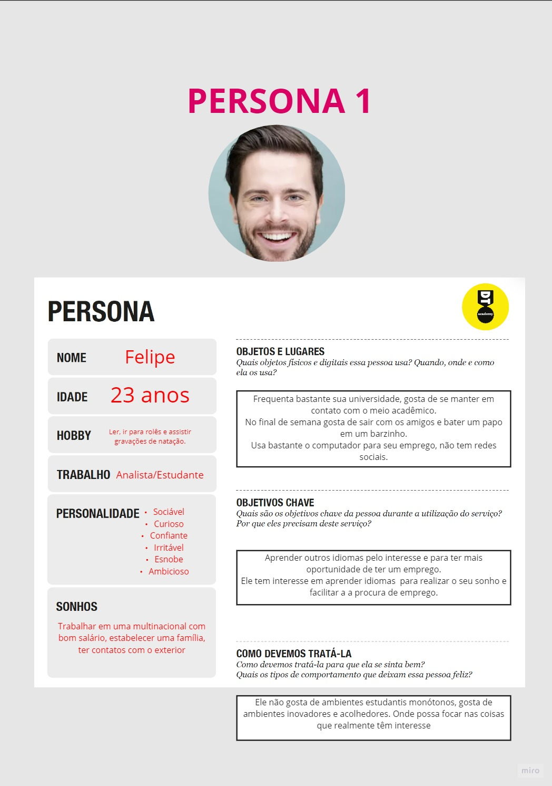

### Persona 2

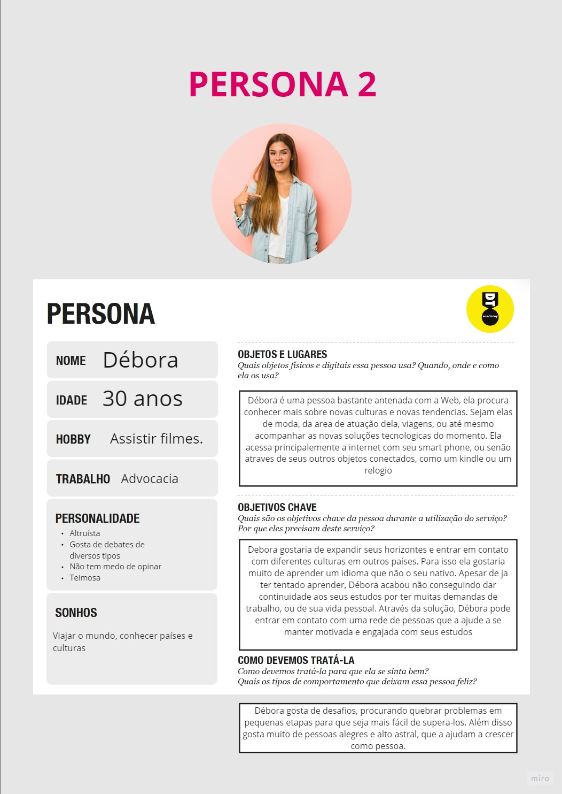

### Persona 3

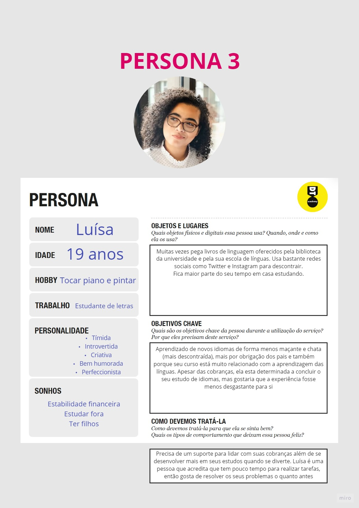

## Histórias de Usuários

Com base na análise das personas forma identificadas as seguintes histórias de usuários:

|EU COMO... `PERSONA`| QUERO/PRECISO ... `FUNCIONALIDADE` |PARA ... `MOTIVO/VALOR`                 |
|--------------------|------------------------------------|----------------------------------------|
|Felipe  | Aesenvolver a minha língua inglesa, para que eu possa trabalhar em uma multinacional           | Poder trabalhar em uma multinacional e sanar meu interesse pessoal               |
|Débora       | Aprender o básico das línguas de alguns determinados países                 | Poder conhecer o mundo |
|Luísa       | Aprender idiomas de forma mais descontraída                 | Absorver melhor conhecimentos e de forma menos desgastante. |

## Requisitos

As tabelas que se seguem apresentam os requisitos funcionais e não funcionais que detalham o escopo do projeto.

### Requisitos Funcionais

|ID    | Descrição do Requisito  | Prioridade |
|------|-----------------------------------------|----|
|RF-001| O site deve conter um sistema de sign up/login | ALTA | 
|RF-002| O site deve ter uma página de perfil do usuário   | ALTA |
|RF-003| O site deve ter uma página contendo informações sobre o projeto e grupo   | MÉDIA |
|RF-004| O site deve conter um sistema de botões para escolher o idioma desejado para a aprendizagem/consulta   | ALTA |
|RF-005| O site deve conter tópicos de vocabulário para determinadas situações/ambientes   | MÉDIA |
|RF-006| O site deve ter um sistema de recompensa para o usuário   | MÉDIA |
|RF-007| O site deve ter recomendações de mídias (Filmes, Séries, Livros, Músicas...) de cada língua   | MÉDIA |
|RF-008| O site deve dar liberdade do usuário de definir sua rotina   | ALTA |
|RF-009| o site deve conter artigos rápidos e divertidos de cada língua   | MÉDIA |
|RF-010| O site deve possuir uma agenda para registrar o estudo de cada dia do usuário   | BAIXA |

### Requisitos não Funcionais

|ID     | Descrição do Requisito  |Prioridade |
|-------|-------------------------|----|
|RNF-001| O site deve ser responsivo | MÉDIA | 
|RNF-002| Deve ser utilizado o git para versionamento do projeto | ALTA | 
|RNF-003| O site deve utilizar da Stack HTML, CSS e JS para construção | MÉDIA | 

## Restrições

O projeto está restrito pelos itens apresentados na tabela a seguir.

|ID| Restrição                                             |
|--|-------------------------------------------------------|
|01| O projeto deverá ser entregue até o final do semestre |
|02| Não pode ser desenvolvido um módulo de backend        |

# Projeto de Interface

Com funções interativas, baseado em design intuitivo e divertido, a interface do projeto se baseará em telas de Index, Cadastro, Login, Sobre, Seleção de Línguas, Seleção de Categorias, Tela de Categorias e Artigos, e Perfil de Usuário.

## User Flow

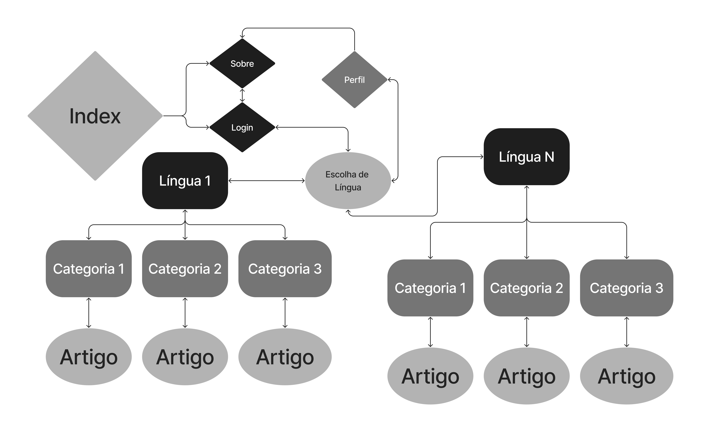

## Wireframes

### Tela Inicial:

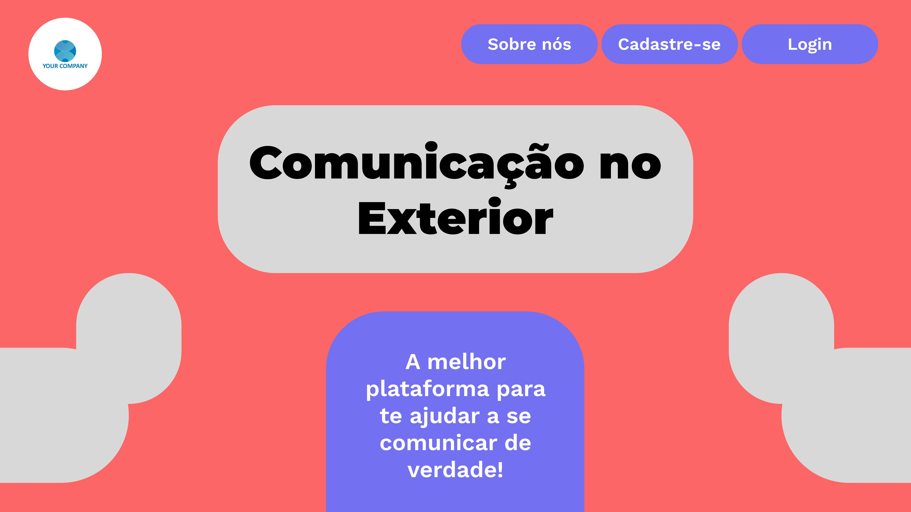

### Cadastro:

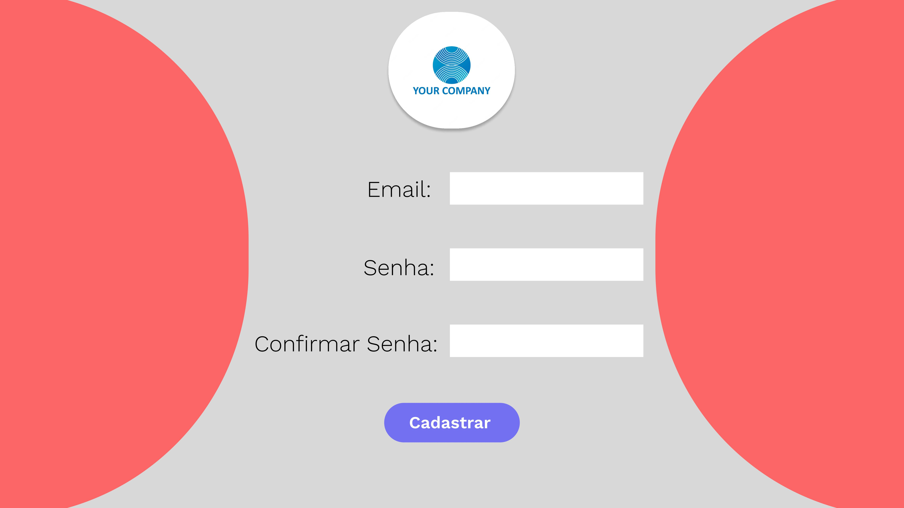

### Login:

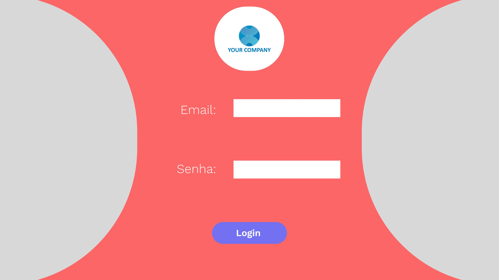

### Seleção de Línguas:

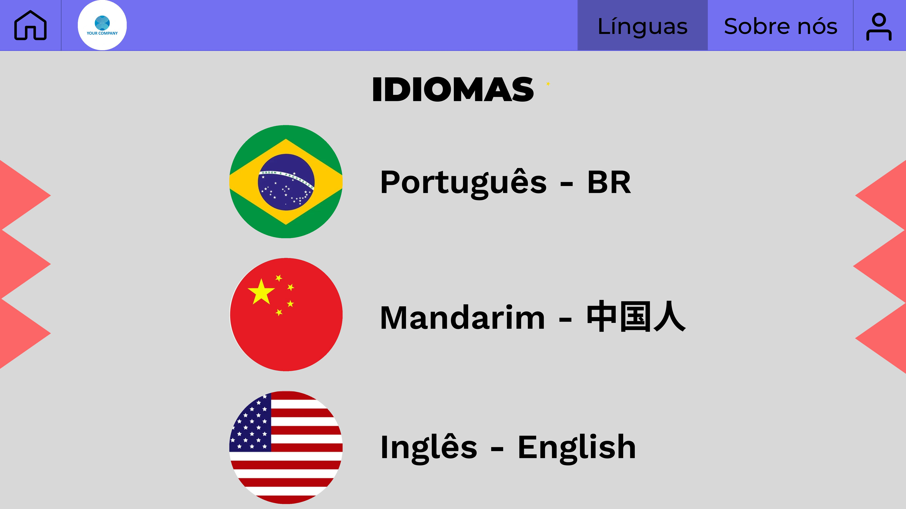

### Seleção de Categorias:

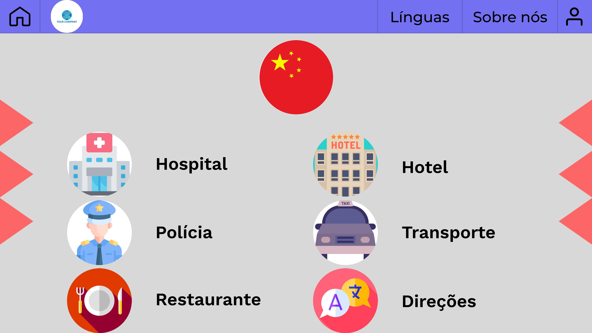

### Template de Categorias/Artigos:

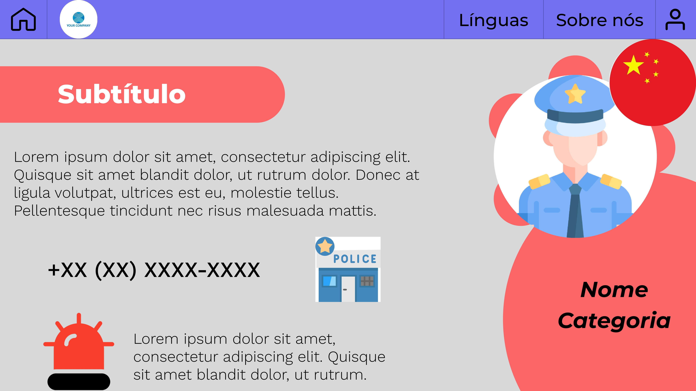

### Perfil:

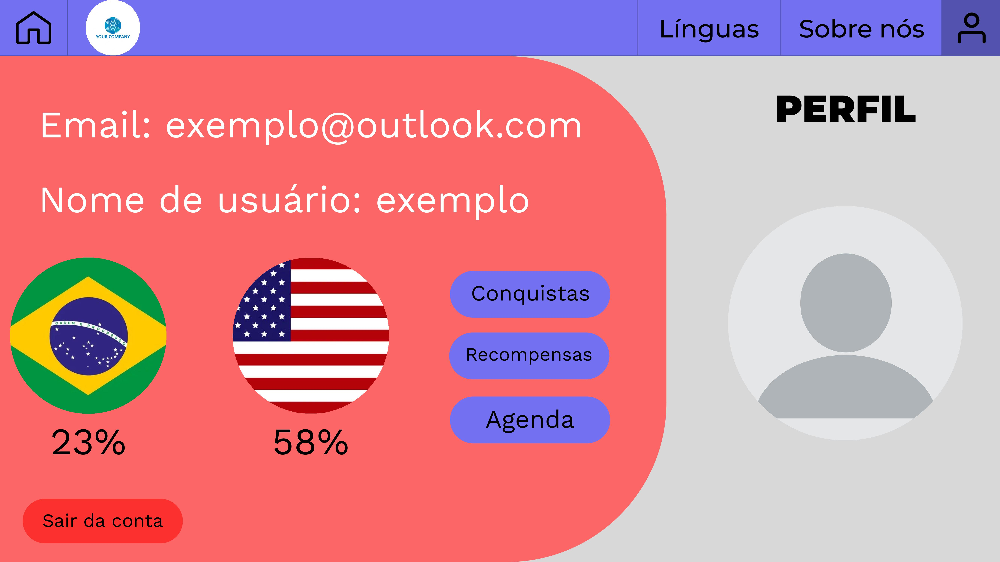

### Sobre:

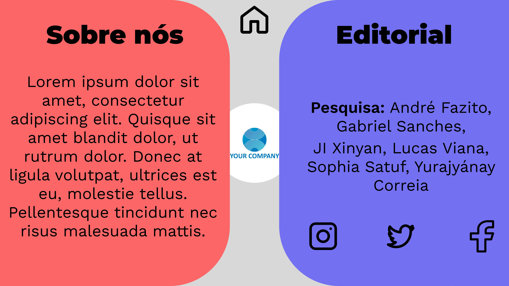

### Protótipo Interativo

Link: https://www.figma.com/proto/s2AlOPvbXY4UcJ9m20rTKL/Untitled?node-id=0%3A1.

# Metodologia

Ao iniciar um novo projeto é necessário medir, de alguma forma, o nível de compromisso que é demandado de cada indivíduo, ou de um time. Com isso em mente, a equipe se baseou no modelo de trabalho do Scrum, para não somente conseguir visualizar uma lista de requisitos, mas também atribuir, distribuir e planejar configurações de designação de tarefas que priorizasse não somente agilidade, mas o melhor aproveitamento dos talentos de cada membro da equipe.

 A equipe buscou adaptar o Scrum porque acredita que ajustes são necessários ao se entrar em contato com um modelo novo, mas também por acreditar que o Scrum pode ser potencializado ao ser visto como uma ferramenta que trabalha em favor da equipe. Dessa forma, algumas cerimônias do Scrum, como planejamento e revisão da sprint, foram priorizadas em detrimento de outras, como as “daily”. 
 
Apesar de não ter realizado uma “daily” diariamente, como sugere o Scrum, a equipe buscou manter um canal de comunicação aberto, claro e sincero, visando como resultado alinhamento do andamento do projeto, das tarefas individuais, trocas de ideias e eventuais tarefas que poderiam em situação de dependência com outras. Para nosso alinhamento e comunicação utilizamos Discord, Whatsapp e Trello.

 No whatsapp realizamos trocas rápidas de alinhamento, no Discord fizemos reuniões virtuais para executar tarefas e discutir ideias, e no Trello estabelecemos nosso backlog. Ainda no Trello utilizamos um template de quadro Kanban para traduzir os “materiais entregáveis”, que foram passados pelo professor, para tarefas objetivas e executáveis no backlog. Distribuímos as tarefas às pessoas a quem elas fossem atribuídas, o que era previamente acordado em equipe. E por fim, definimos a dificuldade de cada tarefa usando um sistema de código baseado em cores. Para definir dificuldade utilizamos alguns critérios, dentre eles: data de entrega, esforço e tempo.

## Divisão de Papéis

André Fazito Morais - Processo de Design Thinking.

Gabriel Sanches Rezende - Processo de Design Thinking, Documentação do Projeto, Repositório GitHub.

Ji Xinyi - Processo de Design Thinking, Documentação do Projeto.

Lucas Viana Ferreira - Processo de Design Thinking, Documentação do Projeto, Apresentação.

Sophia Damasceno Satuf - Processo de Design Thinking, Documentação do Projeto.

Yurajyánay Correia Andaluz - Processo de Design Thinking, Documentação do Projeto, Apresentação.

## Ferramentas

| Ambiente  | Plataforma              |Link de Acesso |
|-----------|-------------------------|---------------|
|Processo de Design Thinkgin  | Miro |  https://miro.com/app/board/uXjVPT6fBs0=/ | 
|Repositório de código | GitHub | https://github.com/orgs/ICEI-PUC-Minas-PPLCC-TI/teams/comunicacao-no-exterior | 
|Hospedagem do site | Heroku |  https://herokuapp.com | 
|Protótipo Interativo | Figma | https://www.figma.com/proto/s2AlOPvbXY4UcJ9m20rTKL/Untitled?node-id=0%3A1 | 
|Editor de Código | Visual Studio Code | https://code.visualstudio.com/ | 
|Organização Kanban | Trello | https://trello.com/b/RgZd5b5s/quadro-kanban | 
|Comunicação/Reuniões | Discord | https://discord.com/ | 

## Controle de Versão

 A ferramenta de controle de versão adotada no projeto foi o
 [Git](https://git-scm.com/), sendo que o [Github](https://github.com)
 foi utilizado para hospedagem do repositório `upstream`.
 
 O projeto segue a seguinte convenção para o nome de branchs:

- `master`: versão estável já testada do software
- `unstable`: versão já testada do software, porém instável
- `testing`: versão em testes do software
- `dev`: versão de desenvolvimento do software
 
Quanto à gerência de issues, o projeto adota a seguinte convenção para
etiquetas:

- `bugfix`: uma funcionalidade encontra-se com problemas
- `enhancement`: uma funcionalidade precisa ser melhorada
- `feature`: uma nova funcionalidade precisa ser introduzida

# Projeto da Solução

  Para solucionar o problema apresentado, criamos um site com o intuito de facilitar o aprendizado de linguagens, trazendo ao usuário maior interação com determinada língua e até um pouco da cultura que a envolve.
  
  Nossa aplicação consiste em páginas Web dinâmicas de conteúdo de vocabulário em diversas línguas, um fórum na página de cada língua para que haja interação entre os usuários que aprendem tal idioma, perfil editável e busca de categorias.

## Tecnologias Utilizadas

  Para a construção do site, usamos HTML para a estruturação das páginas, CSS para customização e estilização e JavaScript para as funcionalidades. Usamos o Local Storage para armazenamento dos dados (JSON) e Bootstrap para alguns componentes.
  
  Continuamos usando a framework SCRUM ao longo do projeto.
  
  As ferramentas usadas foram replit para organização, github como repositório, visual studio code como ferramenta de desenvolvimento.
  
  > 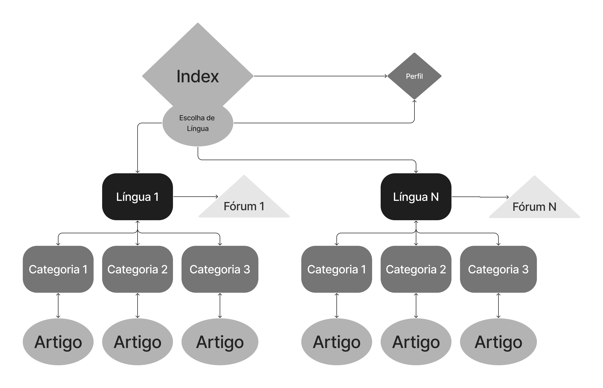

## Arquitetura da solução

 A solução se baseia em uma Home-Page, um index que contém a seleção de línguas para o site e, dessa seleção, se apresenta uma nova aba para as categorias da língua previamente selecionada, com dinâmica JavaScript implementada. O usuário pode clicar em uma dessas categorias e ler um artigo, com apoio de imagens e texto, para um aprendizado maior no tópico escolhido. Além da seleção de categorias dentro da língua, a página apresenta um link para o fórum de discussão. Neste fórum, o usuário pode realizar um post, comentar o post de outro usuário ou mesmo curtir outro post, com suporte JSON e JavaScript.
> 
 Além disto, o usuário, na Home-Page, poderá clicar na aba do Perfil, editar seu perfil, com nome, email, etc. Além de uma aba para a personalização de sua recomendação de mídias em diversas línguas. Tudo com estrutura JSON e JavaScript.
> 
> 
> 
> 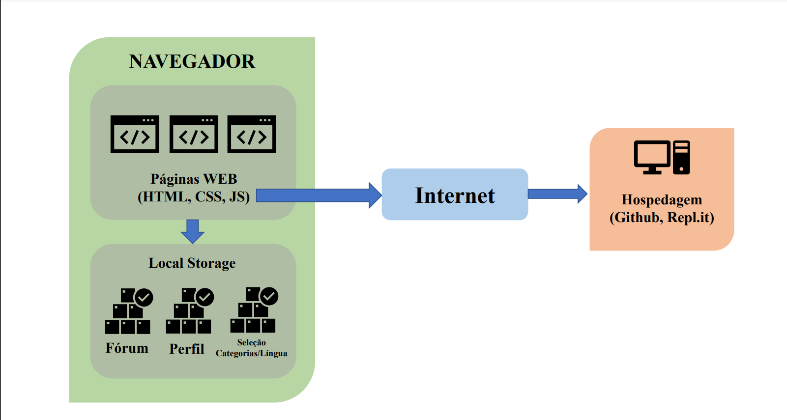

# Avaliação da Aplicação

  Os cenários utilizados para testes foram: 
- Verificar se, após inseridas informações na página de edição de perfil, elas salvam e aparecem corretas na página do perfil. 
- Navegação pela NavBar de mídias recomendadas dentro do perfil do usuário.
- Verificar funcionalidade do fórum.
- Busca na aba de pesquisas.
- Verificar a funcionalidade dos cabeçalhos de cada página.
- Seleção de categorias na aba da língua

## Plano de Testes

......  COLOQUE AQUI O SEU TEXTO ......

> Enumere quais cenários de testes foram selecionados para teste. Neste
> tópico o grupo deve detalhar quais funcionalidades avaliadas, o grupo
> de usuários que foi escolhido para participar do teste e as
> ferramentas utilizadas.
> 
> **Links Úteis**:
> - [IBM - Criação e Geração de Planos de Teste](https://www.ibm.com/developerworks/br/local/rational/criacao_geracao_planos_testes_software/index.html)
> - [Práticas e Técnicas de Testes Ágeis](http://assiste.serpro.gov.br/serproagil/Apresenta/slides.pdf)
> -  [Teste de Software: Conceitos e tipos de testes](https://blog.onedaytesting.com.br/teste-de-software/)

## Ferramentas de Testes (Opcional)

......  COLOQUE AQUI O SEU TEXTO ......

> Comente sobre as ferramentas de testes utilizadas.
> 
> **Links Úteis**:
> - [Ferramentas de Test para Java Script](https://geekflare.com/javascript-unit-testing/)
> - [UX Tools](https://uxdesign.cc/ux-user-research-and-user-testing-tools-2d339d379dc7)

## Registros de Testes

......  COLOQUE AQUI O SEU TEXTO ......

> Discorra sobre os resultados do teste. Ressaltando pontos fortes e
> fracos identificados na solução. Comente como o grupo pretende atacar
> esses pontos nas próximas iterações. Apresente as falhas detectadas e
> as melhorias geradas a partir dos resultados obtidos nos testes.

# Referências

GUSMÃO, Cristine Martins Gomes, MACHIAVELLI, Josiane Lemos, MENDES, Priscilla Batista, SOARES, Rannieri Araújo Soares, Fóruns de Discussão em Ambientes Virtuais de Aprendizagem: Um Mapeamento Sistemático do seu Uso nos Contextos Brasileiro e Latino-Americano, 31 de julho de 2020.

MEDINA, Rafael Sales, DA SILVA, Ana Paula Couto, MURAI, Fabrício, Análise das Interações Sociais em Comunidades Online de Aprendizado de Idiomas: um estudo de caso no Reddit, 26 de julho de 2018.

ESPER, Marcos Vinícius, Crianças com deficiência e aprendizagem de línguas estrangeiras: contribuições e reflexões, São Paulo, 2021.

